# DocsHub Architecture Documentation

> A comprehensive guide to the architecture, design patterns, and system structure of DocsHub

---

## 📐 Table of Contents

1. [System Overview](#system-overview)
2. [Architecture Diagram](#architecture-diagram)
3. [Technology Stack](#technology-stack)
4. [Component Structure](#component-structure)
5. [Data Flow](#data-flow)
6. [Module Dependencies](#module-dependencies)
7. [Database Schema](#database-schema)
8. [API Architecture](#api-architecture)
9. [Real-time Collaboration](#real-time-collaboration)
10. [Testing Architecture](#testing-architecture)
11. [Deployment Architecture](#deployment-architecture)

---

## 🏗️ System Overview

DocsHub is a modern, real-time collaborative document and spreadsheet editor built with a **Django REST API backend** and a **React TypeScript frontend**, connected via **WebSockets** for real-time synchronization.

### Core Principles

- **Separation of Concerns**: Clear separation between frontend and backend
- **RESTful API**: Standard REST endpoints for all operations
- **Real-time Sync**: WebSocket-based collaboration for instant updates
- **Role-Based Access**: Fine-grained permission system
- **Scalable Design**: Modular architecture for easy extension

---

## 🎨 Architecture Diagram

### High-Level System Architecture

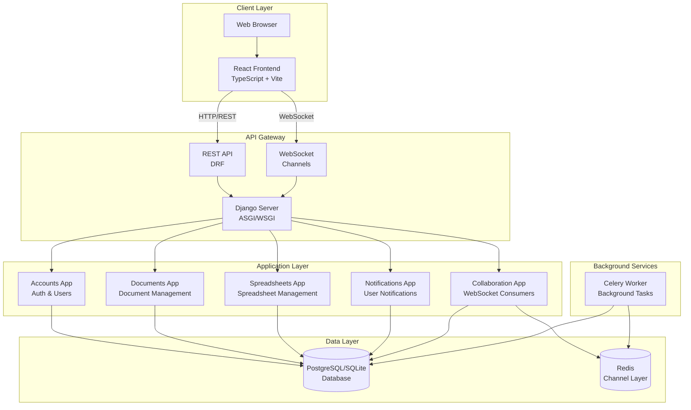

### Component Interaction Flow

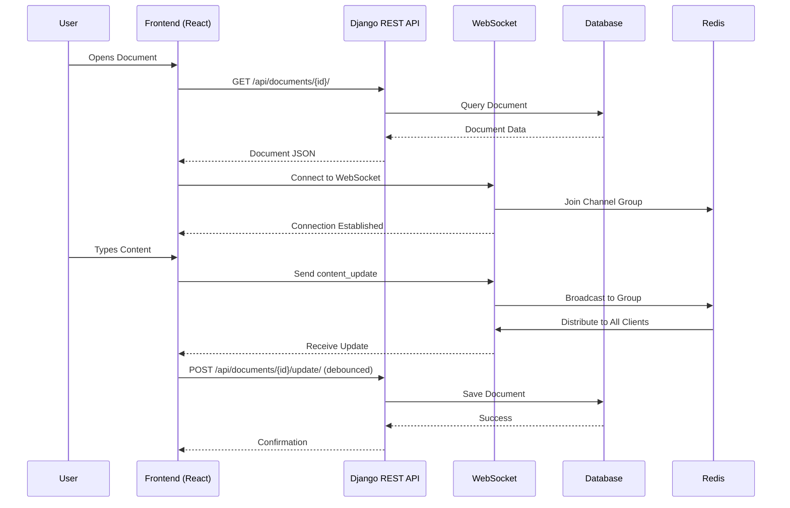

---

## 🛠️ Technology Stack

### Backend Stack

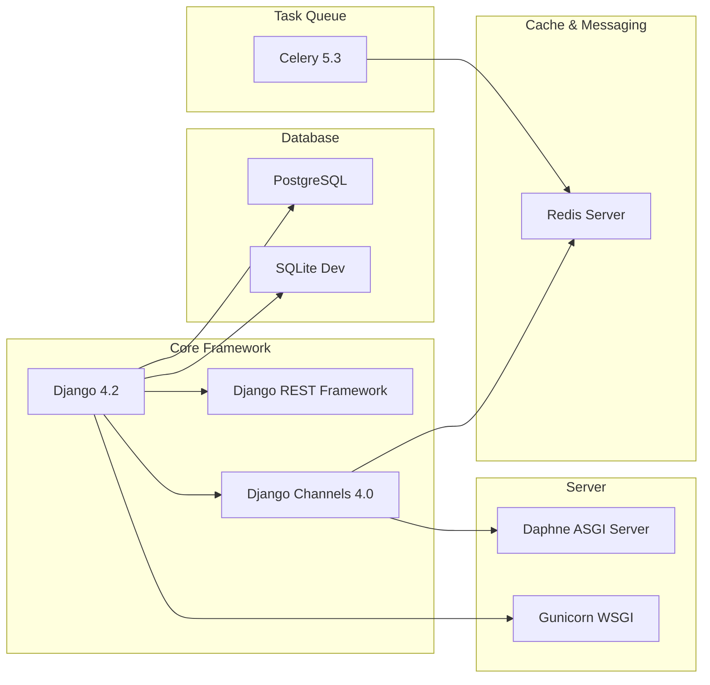

### Frontend Stack

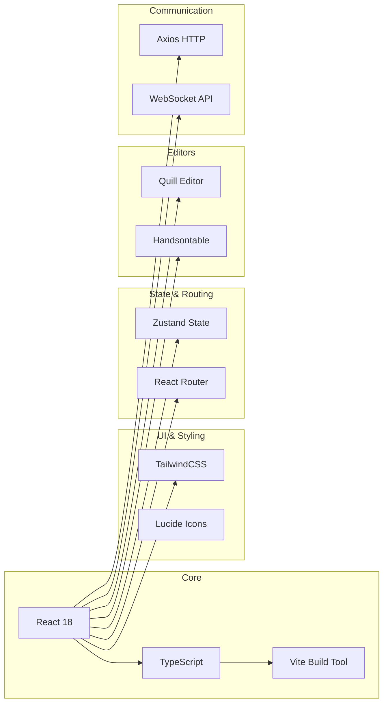

---

## 🧩 Component Structure

### Django App Structure

```mermaid
graph TD
    subgraph "docshub (Project Root)"
        Settings[settings.py<br/>Configuration]
        URLs[urls.py<br/>URL Routing]
        ASGI[asgi.py<br/>WebSocket Setup]
        WSGI[wsgi.py<br/>HTTP Setup]
    end
    
    subgraph "accounts App"
        A_Models[models.py<br/>User Models]
        A_Views[views.py<br/>Auth Views]
        A_API[api.py<br/>Auth API]
        A_Admin[admin.py<br/>User Admin]
    end
    
    subgraph "documents App"
        D_Models[models.py<br/>Document Models]
        D_API[api.py<br/>Document API]
        D_Views[views.py<br/>Document Views]
        D_Utils[utils.py<br/>Document Utils]
        D_Admin[admin.py<br/>Document Admin]
    end
    
    subgraph "spreadsheets App"
        S_Models[models.py<br/>Spreadsheet Models]
        S_API[api.py<br/>Spreadsheet API]
        S_Utils[utils.py<br/>Spreadsheet Utils]
        S_Admin[admin.py<br/>Spreadsheet Admin]
    end
    
    subgraph "notifications App"
        N_Models[models.py<br/>Notification Models]
        N_API[api.py<br/>Notification API]
        N_Context[context_processors.py<br/>Template Context]
    end
    
    subgraph "collaboration App"
        C_Consumers[consumers.py<br/>WebSocket Consumers]
        C_Routing[routing.py<br/>WebSocket Routes]
    end
    
    Settings --> A_Models
    Settings --> D_Models
    Settings --> S_Models
    Settings --> N_Models
    URLs --> A_API
    URLs --> D_API
    URLs --> S_API
    URLs --> N_API
    ASGI --> C_Routing
    C_Routing --> C_Consumers
```

### Frontend Component Structure

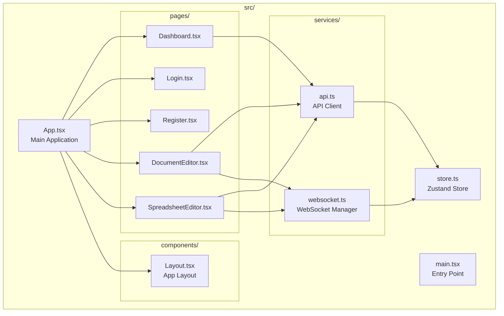

---

## 🔄 Data Flow

### Document Editing Flow

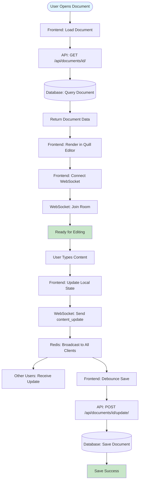

### Authentication Flow

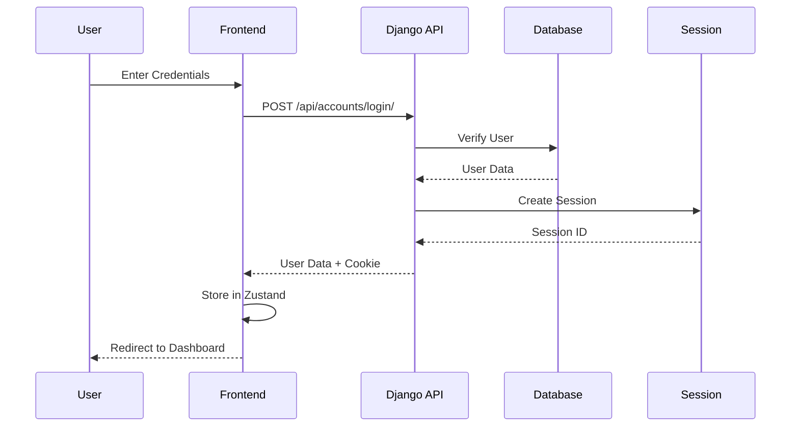

### Document Sharing Flow

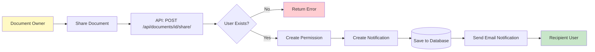

---

## 🔗 Module Dependencies

### Backend Dependencies Graph

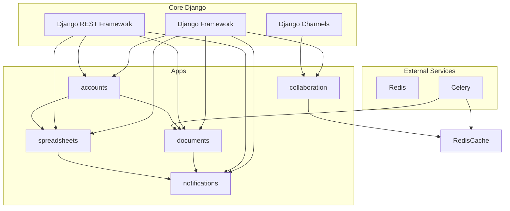

### Frontend Dependencies Graph

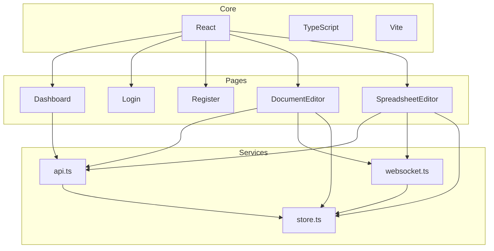

---

## 🗄️ Database Schema

### Entity Relationship Diagram

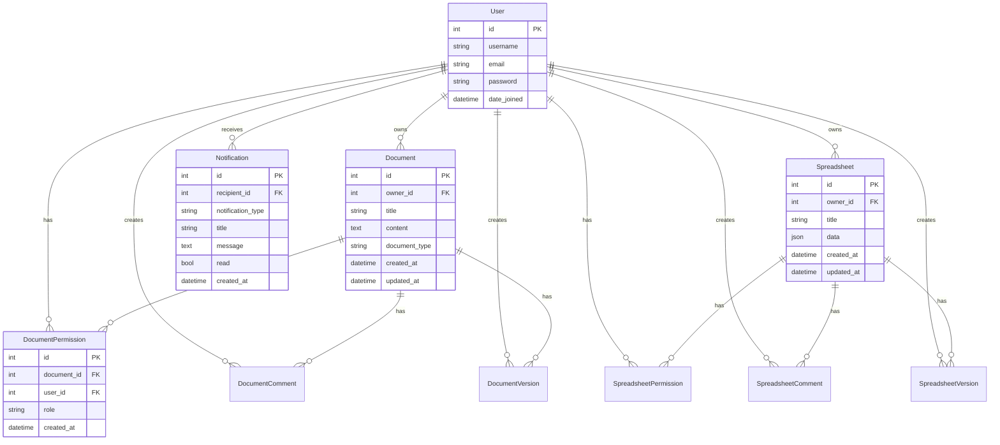

### Model Relationships

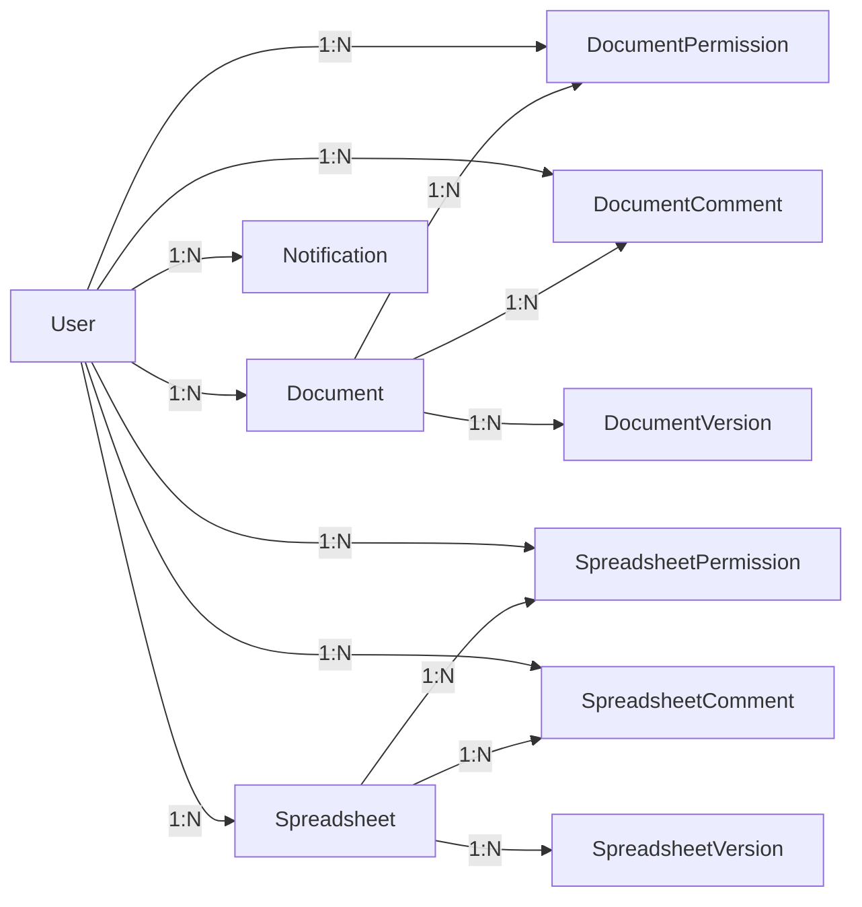

---

## 🌐 API Architecture

### API Endpoint Structure

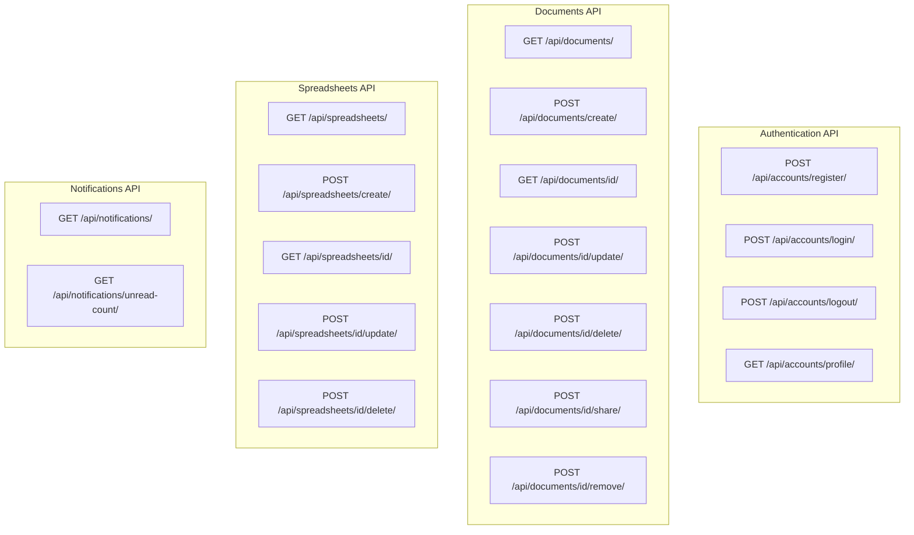

### API Request/Response Flow

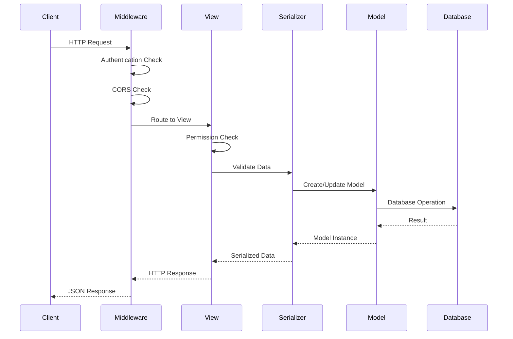

---

## ⚡ Real-time Collaboration

### WebSocket Architecture

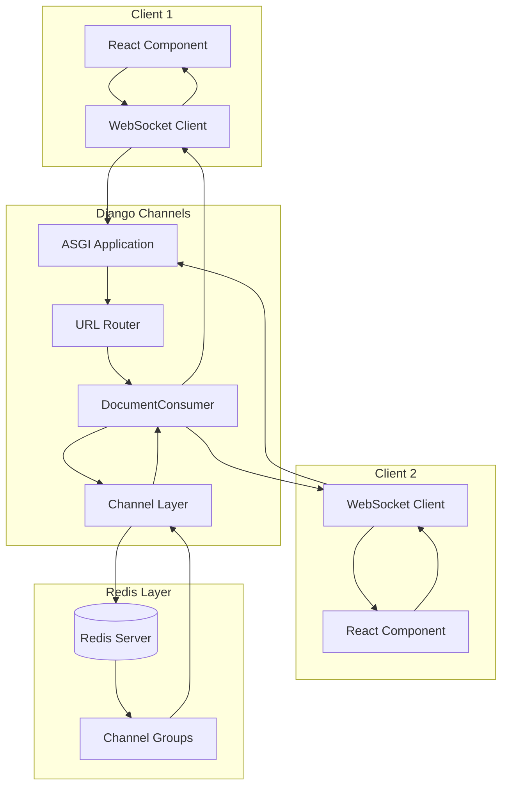

### Real-time Update Flow

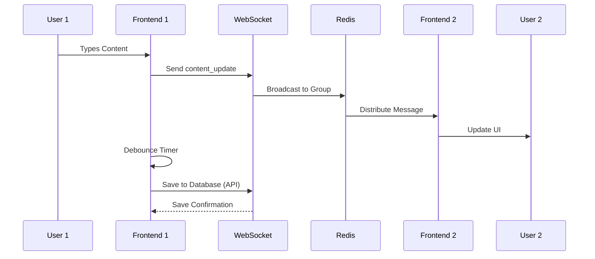

---

## 🧪 Testing Architecture

### Test Coverage Map

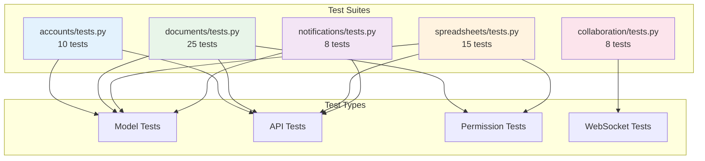

### Test Execution Flow

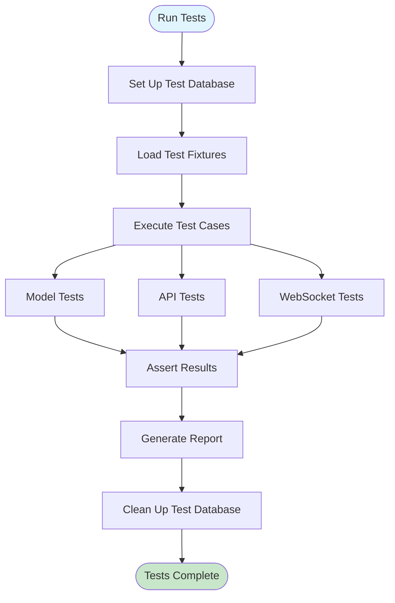

---

## 🚀 Deployment Architecture

### Production Deployment

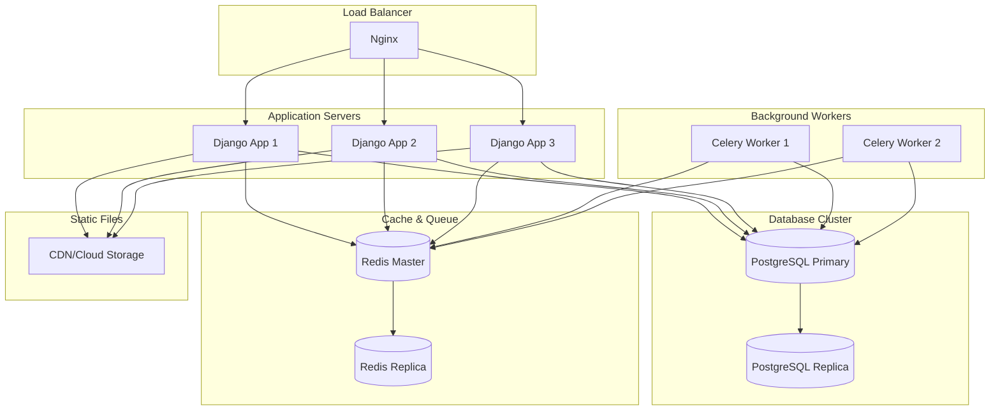

---

## 📊 System Metrics & Monitoring

### Key Performance Indicators

```mermaid
graph LR
    subgraph "Performance"
        Latency[API Latency]
        Throughput[Request Throughput]
        WS_Conn[WebSocket Connections]
    end
    
    subgraph "Reliability"
        Uptime[System Uptime]
        Error_Rate[Error Rate]
        Success_Rate[Success Rate]
    end
    
    subgraph "Scalability"
        Concurrent_Users[Concurrent Users]
        DB_Conn[Database Connections]
        Redis_Mem[Redis Memory]
    end
```

---

## 🔐 Security Architecture

### Security Layers

```mermaid
graph TD
    subgraph "Network Layer"
        HTTPS[HTTPS/TLS]
        WSS[WSS/TLS]
    end
    
    subgraph "Application Layer"
        Auth[Authentication]
        Authz[Authorization]
        CSRF[CSRF Protection]
        CORS[CORS Policy]
    end
    
    subgraph "Data Layer"
        Encryption[Data Encryption]
        Validation[Input Validation]
        Sanitization[Output Sanitization]
    end
    
    HTTPS --> Auth
    WSS --> Auth
    Auth --> Authz
    Authz --> CSRF
    CSRF --> CORS
    CORS --> Encryption
    Encryption --> Validation
    Validation --> Sanitization
```

---

## 📝 Summary

### Architecture Highlights

- ✅ **Modular Design**: Clear separation of concerns with Django apps
- ✅ **RESTful API**: Standard REST endpoints for all operations
- ✅ **Real-time Sync**: WebSocket-based collaboration via Django Channels
- ✅ **Scalable**: Horizontal scaling support with Redis and Celery
- ✅ **Tested**: Comprehensive test suite covering all major features
- ✅ **Secure**: Multiple layers of security (HTTPS, authentication, authorization)
- ✅ **Type-Safe**: TypeScript on frontend, type hints in Python
- ✅ **Modern Stack**: Latest versions of Django, React, and supporting libraries

### Technology Choices

| Layer | Technology | Reason |
|-------|-----------|--------|
| **Backend** | Django 4.2 | Mature, feature-rich, excellent ORM |
| **API** | Django REST Framework | Industry standard, well-documented |
| **WebSocket** | Django Channels | Native Django integration |
| **Frontend** | React 18 + TypeScript | Modern, type-safe, component-based |
| **Database** | PostgreSQL | Robust, ACID-compliant, scalable |
| **Cache** | Redis | Fast, supports pub/sub for WebSockets |
| **Task Queue** | Celery | Reliable background task processing |

---

**Last Updated**: 2025-01-27  
**Version**: 1.0.0  
**Maintainer**: DocsHub Development Team

