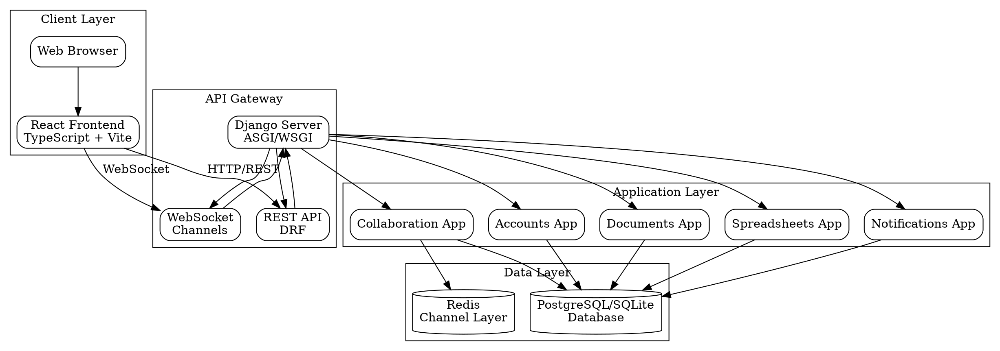
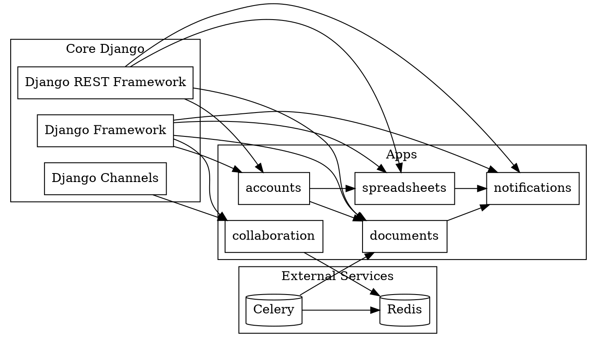
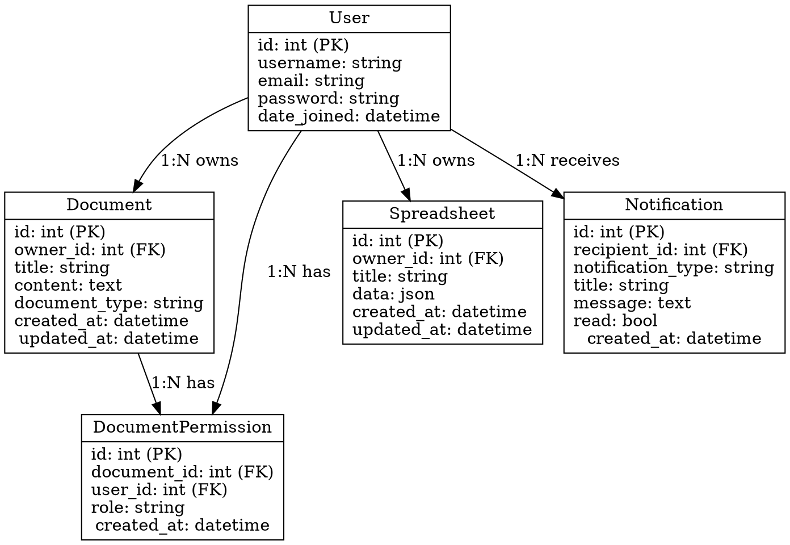
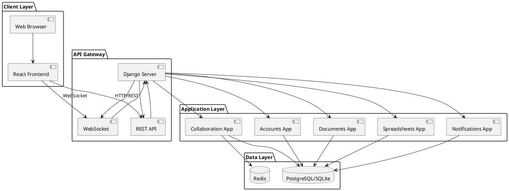
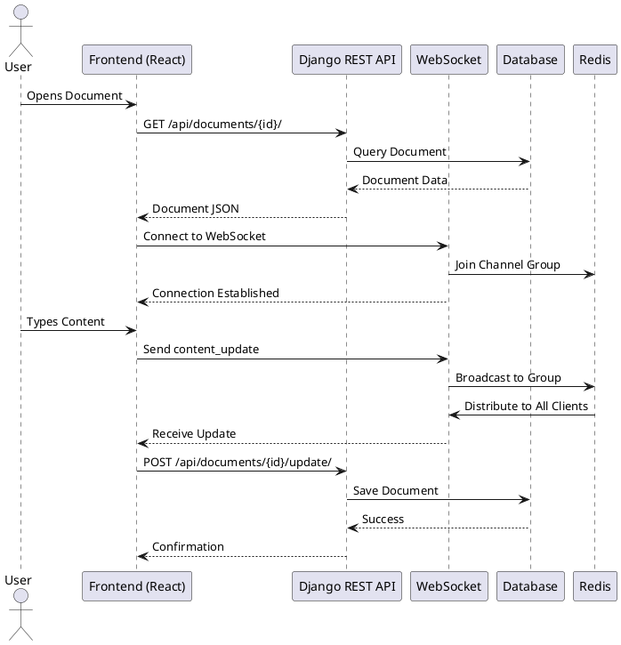

# Architecture Diagrams - Source Files

This file contains diagram source code that can be rendered using various tools.

## Mermaid Diagrams

All diagrams in `ARCHITECTURE.md` are written in Mermaid syntax. You can:

1. **View in GitHub**: Mermaid diagrams render automatically in GitHub markdown
2. **View in VS Code**: Install the "Markdown Preview Mermaid Support" extension
3. **Export as Images**: Use [Mermaid Live Editor](https://mermaid.live/) or [Mermaid CLI](https://github.com/mermaid-js/mermaid-cli)

## Graphviz DOT Format

### System Architecture (DOT)



### Module Dependencies (DOT)



### Database Schema (DOT)



## PlantUML Format

### Component Diagram (PlantUML)



### Sequence Diagram (PlantUML)



## Rendering Instructions

### Using Mermaid CLI

```bash
# Install Mermaid CLI
npm install -g @mermaid-js/mermaid-cli

# Render diagram to PNG
mmdc -i architecture.mmd -o architecture.png

# Render diagram to SVG
mmdc -i architecture.mmd -o architecture.svg
```

### Using Graphviz

```bash
# Install Graphviz
# Ubuntu/Debian: sudo apt-get install graphviz
# macOS: brew install graphviz
# Windows: Download from https://graphviz.org/

# Render DOT file
dot -Tpng architecture.dot -o architecture.png
dot -Tsvg architecture.dot -o architecture.svg
```

### Using PlantUML

```bash
# Install PlantUML
# Download from http://plantuml.com/starting

# Render PlantUML file
java -jar plantuml.jar architecture.puml
```

## Online Tools

- **Mermaid Live Editor**: https://mermaid.live/
- **Graphviz Online**: https://dreampuf.github.io/GraphvizOnline/
- **PlantUML Online**: http://www.plantuml.com/plantuml/uml/

## Export Formats

All diagrams can be exported to:
- **PNG**: For presentations and documents
- **SVG**: For scalable vector graphics
- **PDF**: For documentation
- **HTML**: For interactive web pages

